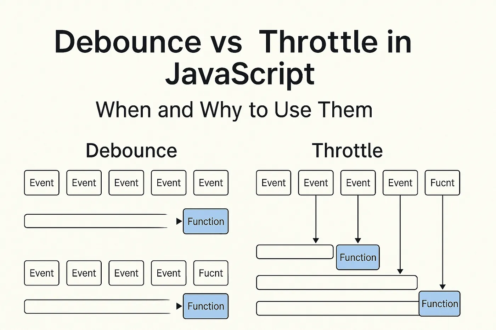

# React 동적 랜더링 최적화 ( Debounce & Throttle )

`디바운스와` `스로틀은` 무엇이냐?
연속으로 발생하는 함수나 이벤트를 묶어서 처리하는 방식
-> 랜더링 최적화를 위한 성능 향상 목적

- 이유 : 함수나 이벤트 처리 하는데에, 매번 모든 함수랑 이벤트 갖다 긁어오면 작업 시간이 많이 걸림

- 묶어서 덩어리 만들어주자 !

<br/>
<br/>

## Debounce & Throttle란 ?



이미지에서 확인할 수 있듯이,

- **디바운스는** 이벤트가 계속 발생이 되고 그걸 "끝까지 " 지켜 보고 함수로 묶어줌.
- **쓰로틀은** 이벤트 중간에 발생할 때 중간중간에 함수로 묶어줌.

<br/>
<br/>

### Debounce 대표예시

- 마지막에 한 번에 묶어서 처리해도 상관 없을때
- 예를 들어, 검색 입력창에서 사용자가 타이핑할 때마다 API 호출을 하지 않고, 입력이 멈춘 후에 한 번만 호출하는 데 유용하다.
- 동적 렌더링에서 불필요한 리렌더나 `API` 요청을 줄여 성능을 최적화합니다.
  **- "검색 자동 완성 "**

<br/>

### Throttle 대표예시

- 중간 중간 끊기지 않는 인터랙션이 필요할 때
- 함수가 일정 시간 간격(예: 200ms)으로만 한 번씩 실행되도록 제한하는 기법.
- " 마우스 이동, 스크롤 이벤트"

<br/>
<br/>

---

# 과제 구현

실질적으로 `Debounce` 와 `Throttle` 을 사용하려면 `setTime`() 함수를 사용해야한다.
두개 모두, 일정 시간과 간격을 두고 함수의 실행을 제한하기 때문에 그러하다!
근데 검색해보니, 커스텀 훅으로 구현하거나 라이브러리를 사용할 수도 있다네??

<br/>

## 내장 라이브러리 lodash 사용

### `.debounce(func, [wait=0], [options={}])`

- 사용자가 입력을 다 끝내고, 일정 시간이 지날 때까지 추가입력이 발생하지 않으면, 검색어 서버로 요청함
- `debounce() `의 인자로 서버에 어떤 요청을 보낼지 이벤트 핸들러 함수 넣어주고, 시간 정하기

```jsx
//검색 입력의 경우 300~500ms가 사용자 경험상 더 자연스러울
const debouncedOnChange = debounce(handleChange, 500);
```

#### 추가 최적화 작업

useCallback으로 메모제이션, useMemo로 캐싱하여 불필요한 debounce 생성 방지

- handleChange : 이벤트 핸들러 함수 , useCallback 으로 감싸서, 매 랜더시 새 함수 생성 방지

### 클린업 함수 사용 이유

`debounce와` `throttle은` 내부적으로 JavaScript의 `setTimeout` (또는 `setInterval에` 준하는 로직)을 사용해서 함수 실행을 지연시키거나 주기적으로 실행한다.
이 과정에서 타이머 정리를 하지 않으면 **메모리 누수** 발생

- 메모리 누수 : `debounce나` `throttle이` 생성한 `setTimeout` 타이머가 메모리가 계속 남아서 데이터가 쌓임 -> 이는 앱 성능 저하로 이어질 수 있다.
